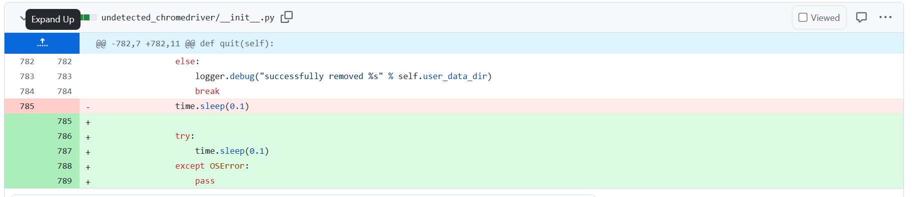

entrar al __init__.py de undetectedchromedriver y comentar la linea 785, despues
reemplazarla por el bloque try except como se ve en la imagen.

Para levantar el streamlit, instalar los requierements y el siguiente comando:

* streamlit run streamlit.py